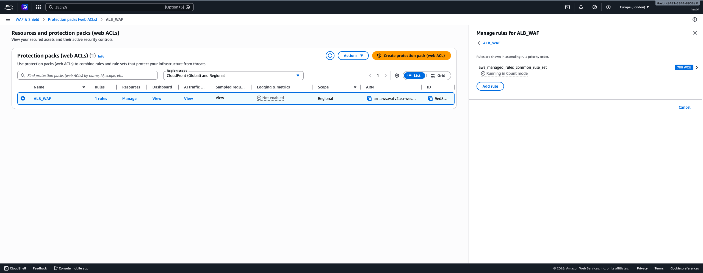
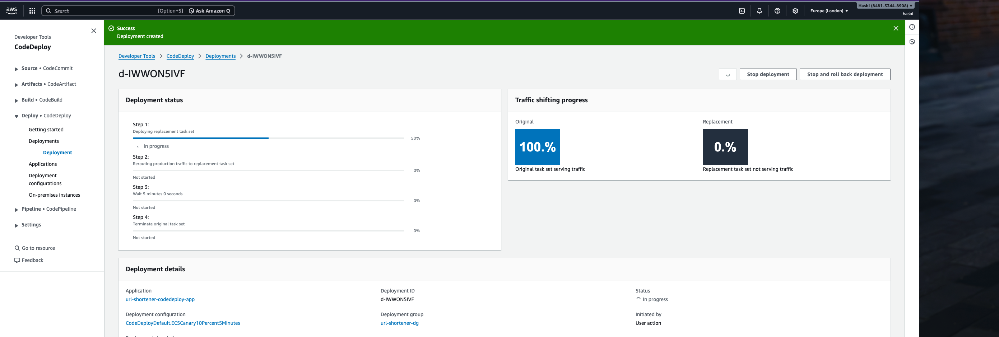
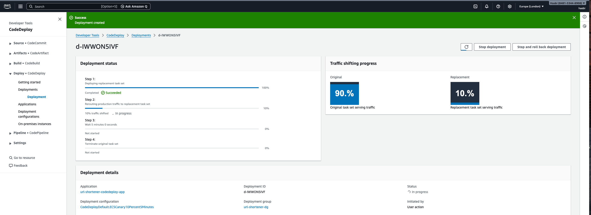
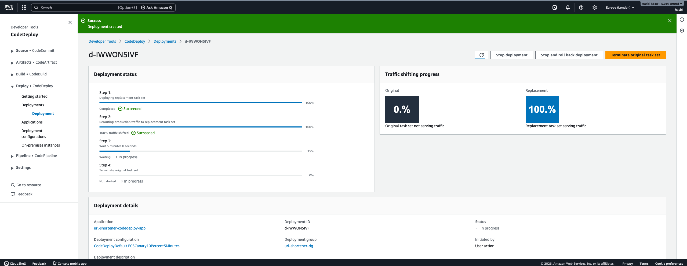
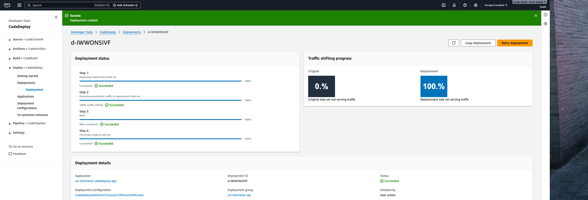

# Automated Blue-Green Canary Deployment on AWS

This is a production-style platform for a FastAPI URL shortener on AWS. Infrastructure is managed with Terraform, while delivery is keyless through GitHub OIDC.
Releases use CodeDeploy blue green deployments to ECS Fargate behind an ALB. The ALB terminates TLS through ACM and is protected by WAF.
The design keeps workloads private through VPC endpoints, and it avoids NAT to reduce cost. IAM access follows least privilege, so the blast radius stays small.

## Architecture


### Network and edge components





### GitHub OIDC trust setup


## Security and Guardrails

AWS WAF sits in front of the ALB, and it uses managed rules to reduce exposure to common web attacks. The ALB terminates TLS with ACM managed certificates, and it redirects HTTP traffic to HTTPS. GitHub Actions authenticates to AWS through OIDC, so credentials are short lived and scoped by role trust policy. IAM permissions are least privilege and are scoped to only what pipelines must manage. ECS tasks run in private subnets, and the service accepts inbound traffic only from the ALB security group. Access to AWS services is routed through VPC endpoints, so the platform avoids NAT and reduces egress cost.

## Getting Started

### Prerequisites

You need an AWS account with permissions to create IAM, ECR, ECS, ALB, ACM, Route53, DynamoDB, and CodeDeploy resources. You also need a public domain and a Route53 hosted zone, so ACM can complete DNS validation and traffic can resolve to the ALB. Install Terraform version 1.6 or later, AWS CLI version 2, Docker with Buildx, and Git. You also need GitHub repository admin access so you can set secrets and run workflows.

You must define this GitHub repository secret before running pipelines:

- `AWS_ROLE_ARN` which points to the IAM role that trusts GitHub OIDC.

### Setup steps

1. Run bootstrap Terraform from `bootstrap/` one time so the state bucket, lock table, ECR repository, and OIDC role exist.
2. Add bootstrap IAM role ARN to repository secret `AWS_ROLE_ARN`.
3. Run main infrastructure from `terraform/` so network, security, ECS, and CodeDeploy resources are created.
   ```bash
   cd terraform
   terraform init -reconfigure
   terraform plan
   terraform apply
   ```
4. Push changes to `app/**` or run CI manually so the image builds, scans, and pushes to ECR.
5. Run the deploy workflow so it registers a new task definition and starts a blue green deployment through CodeDeploy.


## CI/CD and Deployment Flow

1. The CI workflow builds a Docker image from `app/`, scans it with Trivy, and pushes it to ECR under `blue-green-app` with a short commit SHA tag.
2. The Terraform workflow runs TFLint and Checkov, then runs Terraform plan and apply to update the platform safely.
3. The deploy workflow resolves an image URI from the provided tag, or it selects the latest image in ECR. It registers a new ECS task definition revision, updates `revisions/appspec.yml` with the new task definition ARN, then triggers a CodeDeploy ECS blue green deployment and waits for completion.

### CodeDeploy lifecycle visuals







## Repository Layout

Automated-Blue-Green-Canary-Deployment-Project/
|
├── app/                    # FastAPI service, static frontend, and Dockerfile
├── bootstrap/              # Foundation Terraform (state bucket, lock table, OIDC role, ECR)
├── terraform/              # Main Terraform stack and reusable modules
├── revisions/              # CodeDeploy AppSpec template
├── images/                 # Architecture diagrams and deployment screenshots
├── .github/workflows/      # CI, Terraform, and Deploy pipelines
├── .gitignore
└── README.md

## Project Decisions and Tradeoffs

### Infrastructure Design

- **Terraform module boundaries**
  - Decision: The platform is split into modules for VPC, ALB, ECS, IAM, ACM, CodeDeploy, and DynamoDB.
  - Tradeoff: This improves ownership and reuse, but it increases wiring complexity and makes dependency debugging harder.

- **Bootstrap and workload separation**
  - Decision: Foundational resources live in `bootstrap/` and workload resources live in `terraform/`.
  - Tradeoff: This creates clean lifecycle boundaries, but it introduces two entry points and requires stronger runbooks.

### Network and Security

- **Private workloads with VPC endpoints**
  - Decision: ECS tasks run in private subnets and service access goes through VPC endpoints.
  - Tradeoff: Exposure and egress cost are reduced, but network troubleshooting becomes more involved.

- **ALB plus ACM plus WAF**
  - Decision: Traffic enters through ALB with TLS from ACM and L7 filtering from WAF.
  - Tradeoff: Managed security controls improve safety, but resource cost and operational complexity increase.

- **OIDC based GitHub access**
  - Decision: GitHub Actions uses OIDC to assume AWS roles instead of long lived keys.
  - Tradeoff: Secret risk is reduced and auditability improves, but trust policy drift can break pipelines quickly.

### Delivery and Release Strategy

- **Pipeline split by concern**
  - Decision: CI and Terraform and Deploy are separate workflows.
  - Tradeoff: Failure domains are isolated and rollback paths are clearer, but orchestration is more complex than one pipeline.

- **Immutable image tagging**
  - Decision: CI tags images with short commit SHA.
  - Tradeoff: Traceability and reproducibility improve, but manual deploys are less convenient than always using `latest`.

- **CodeDeploy blue green on ECS**
  - Decision: Releases use CodeDeploy traffic shifting with ECS task definition revisions.
  - Tradeoff: Deployment safety and rollback posture improve, but target group and appspec coordination require strict consistency.